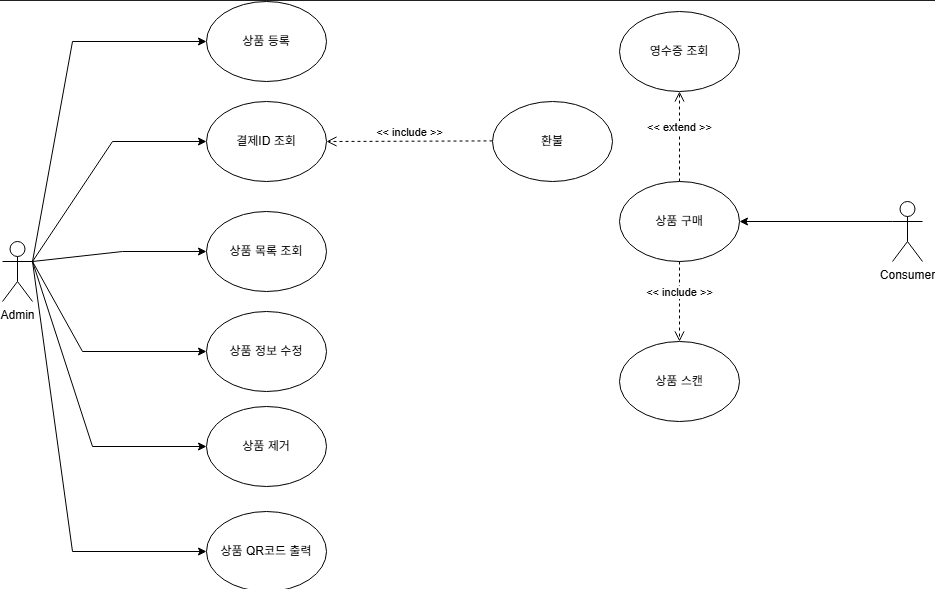
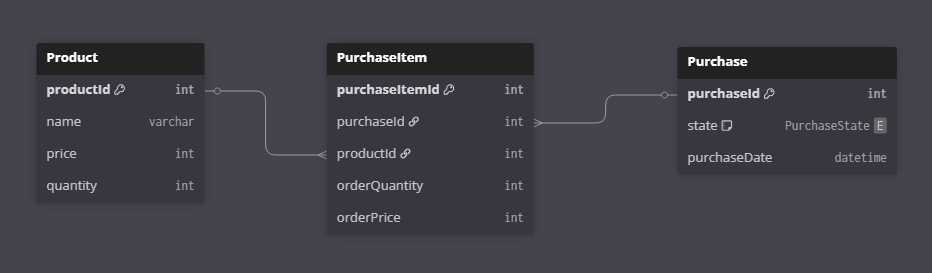
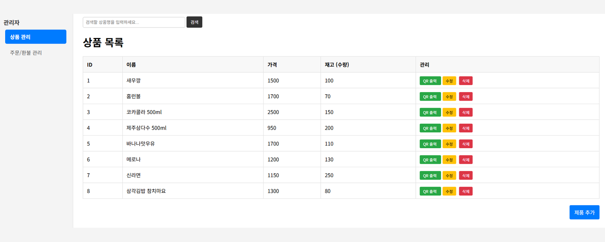
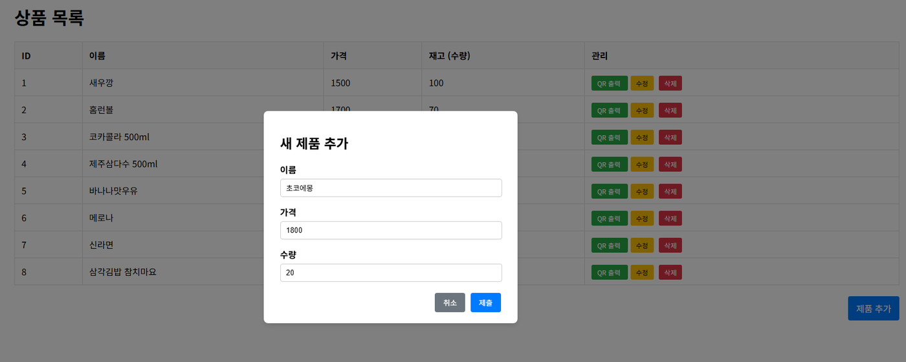
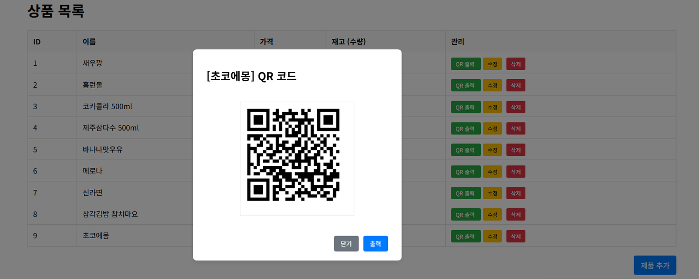
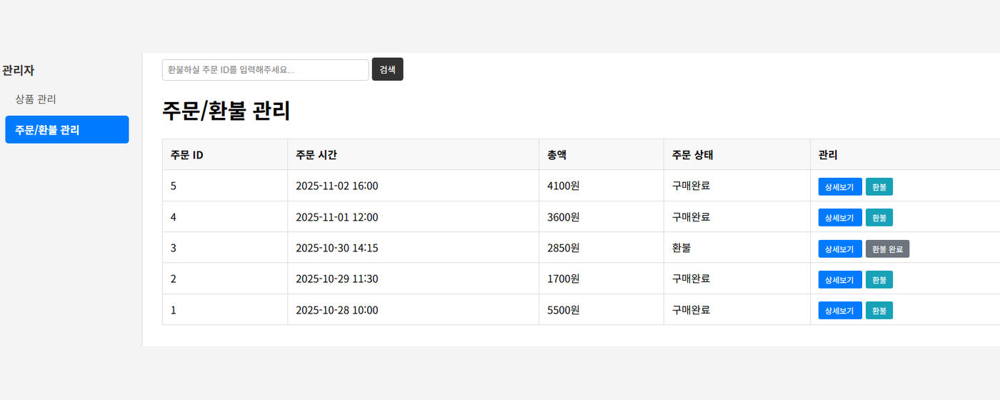
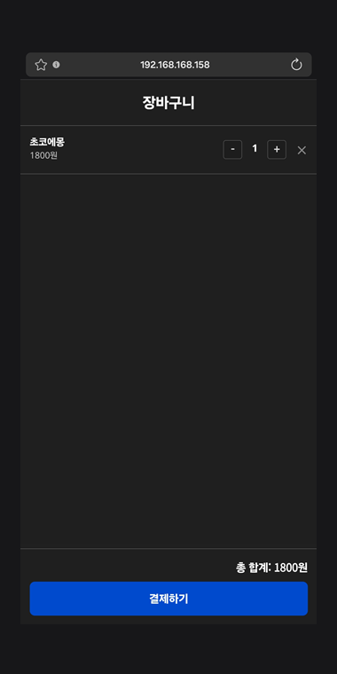
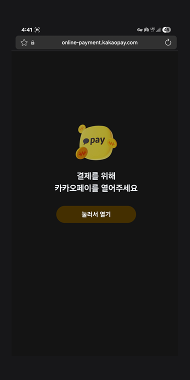
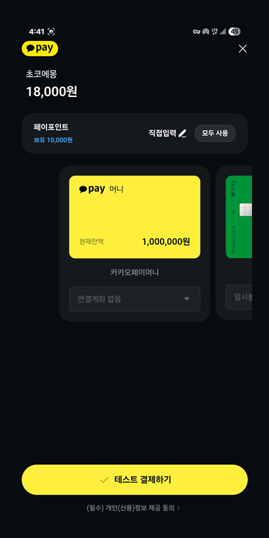
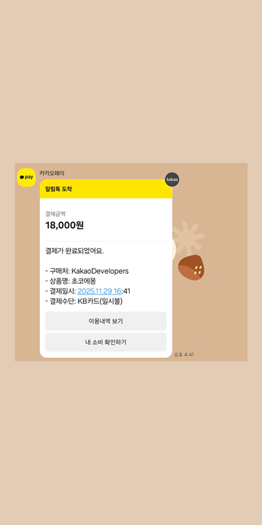

# QR 기반 결제 및 재고 관리 시스템


이 프로젝트는 오프라인 매장에서 상품마다 **QR 코드**를 발급하고, 고객이 QR을 스캔해 장바구니에 담은 뒤 **카카오페이**로 비대면 결제를 진행하면 **재고가 자동으로 차감**되는 결제·재고 관리 웹 애플리케이션입니다. 관리자는 상품 등록·수정·삭제와 QR 발급, 주문 조회·환불을 처리할 수 있고, 고객은 모바일로 상품 검색·수량 조절·결제·구매내역 확인까지 한 번에 수행합니다. **Spring Boot** 백엔드와 **Thymeleaf** 화면, **ZXing** QR 생성, **KakaoPay** 결제 API로 구현했습니다.

---

## 프로젝트 선정 배경

### 1. 오프라인 매장 운영의 비효율
* **수기 재고 관리:** 재고 불일치, 직원의 실수, 결제 누락 등 운영상의 잦은 오류
* **고가의 POS 의존:** 기존 POS 시스템은 도입·유지 비용이 크고 온라인 연동이 제한적
* **실시간성 부재:** 재고 부족·과잉을 즉시 파악하기 어려워 대응이 늦음

### 2. 비대면·간편결제 수요 증가
* **모바일/QR 결제 확산:** 오프라인 매장에서도 비대면·자동화 서비스 수요가 빠르게 증가
* **고객 편의 요구:** 신속한 구매 경험과 구매·결제 내역의 투명한 확인에 대한 요구 상승

### 3. 해결 방향
* **QR 기반 비대면 결제:** 스마트폰으로 상품을 담고 카카오페이로 즉시 결제
* **실시간 재고 자동화:** 결제·환불에 따라 재고가 자동 증감 → 불일치·매출 누락 감소
* **→** 저비용·사용자 친화적인 **POS 대안**으로 매장 운영의 신뢰도와 생산성 향상

<br/>

## Tech Stack (기술 스택)

| 분류 | 기술 |
| :--- | :--- |
| **Language** |  |
| **Backend** |      |
| **View** |     |
| **QR** |   |
| **Payment** |  |
| **Database** |  |
| **Build** |  |
| **Tools** |    |

<br/>

## 시스템 설계

**[유스케이스 다이어그램]** 



**[ERD]** 



<br/>

## Project Structure (폴더 구조)

```bash
QRp/
├── src/main/java/min/example/QRp/
│   ├── QRpApplication.java          # 메인 클래스 (RestTemplate Bean 등록)
│   ├── controller/                  # AdminController, ConsumerController
│   ├── service/                     # AdminService, ConsumerService
│   ├── repository/                  # ProductRepository, PurchaseRepository (EntityManager)
│   ├── domain/                      # Product, Purchase, PurchaseItem, PurchaseState
│   ├── dto/                         # 요청·응답 DTO ( + kakao/ 결제 응답 DTO )
│   └── exception/                   # ExceptionHandler (@RestControllerAdvice 전역 예외)
│
├── src/main/resources/
│   ├── static/
│   │   ├── css/                     # 페이지별·공통(admin-common, payment-common) 스타일
│   │   └── js/                      # 페이지별·공통(admin-common) 스크립트
│   ├── templates/
│   │   ├── admin/                   # products, product-detail, purchases, purchase-detail
│   │   └── consumer/                # cart, payment-success / cancel / fail
│   └── data.sql                     # 샘플 상품·주문 데이터
│
└── build.gradle
```


<br/>

## 주요 기능

### 1. 상품 관리 (관리자)
* **상품 CRUD:** 등록 / 조회(ID·이름) / 수정 / 삭제 — 상품명 중복 및 재고 음수 방지 검증
* **부분 수정:** 수정 시 비워둔 항목은 기존 값 유지

### 2. QR 코드 발급 & 스캔 구매
* **동적 QR 생성:** 상품 ID를 인코딩한 QR 코드(PNG)를 요청 시점에 생성 (DB에 저장하지 않음)
* **스캔 → 담기:** 고객이 QR을 스캔하면 해당 상품이 세션 장바구니에 추가

### 3. 장바구니 & 재고 검증
* **수량 조절:** 장바구니에서 +/− 로 수량 조절, 0이 되면 자동 제거
* **재고 검증:** 수량 추가 시 재고 초과 여부를 실시간 검증, 초과 시 자동 롤백 및 안내

### 4. 카카오페이 결제 & 자동 재고 차감
* **결제 흐름:** 결제 준비(ready) → 카카오페이 결제창 → 승인(approve)
* **무결성 보장:** 결제 **승인 성공 시에만** 주문(Purchase) 생성 및 재고 차감
* **환불:** 관리자 환불 시 주문 상태를 `REFUNDED`로 변경하고 차감된 재고를 복원 (중복 환불 방지)

<br/>

## 시연

**[관리자 — 상품 목록 / 제품 추가]**

 

**[관리자 — QR 코드 발급 / 주문·환불 관리]**

 

**[소비자 — 장바구니 → 카카오페이 결제 → 결제 완료]**

   

<br/>

## Getting Started (실행 가이드)

### 1. 환경 설정
`src/main/resources/application.properties`는 카카오페이 키 등 민감 정보를 담으므로 `.gitignore`에 포함되어 있습니다. **직접 생성**하세요.

```properties
# H2 (인메모리)
spring.datasource.url=jdbc:h2:mem:qrp
spring.jpa.hibernate.ddl-auto=create
spring.jpa.defer-datasource-initialization=true
spring.sql.init.mode=always

# KakaoPay
kakao.admin-key=KakaoAK {YOUR_ADMIN_KEY}
kakao.api-url=https://open-api.kakaopay.com/online
kakao.payment.host=http://localhost:8080
kakao.payment.success-url=/consumer/payment/success
kakao.payment.cancel-url=/consumer/payment/cancel
kakao.payment.fail-url=/consumer/payment/fail
```

### 2. 빌드 및 실행
```bash
# Windows
gradlew.bat bootRun

# macOS / Linux
./gradlew bootRun
```
> 기동 시 `data.sql`의 샘플 데이터가 자동 적재됩니다. 접속 확인: http://localhost:8080/admin/products
> 카카오페이는 테스트용 `CID(TC0ONETIME)`를 사용하며, QR 스캔으로 모바일에서 담으려면 같은 네트워크의 PC IP로 접근해야 합니다.

<br/>

## 개발 정보

| 항목 | 내용 |
| :--- | :--- |
| **팀명** | QR팀 |
| **개발** | 이승민 (팀장) — 백엔드·프론트 전반 (Spring Boot REST, JPA 모델링, QR 발급, 카카오페이 연동) |
| **기간 / 제출** | 2025년도 캡스톤디자인Ⅰ · 2025-11-30 |
| **지도교수** | 임영호 |

